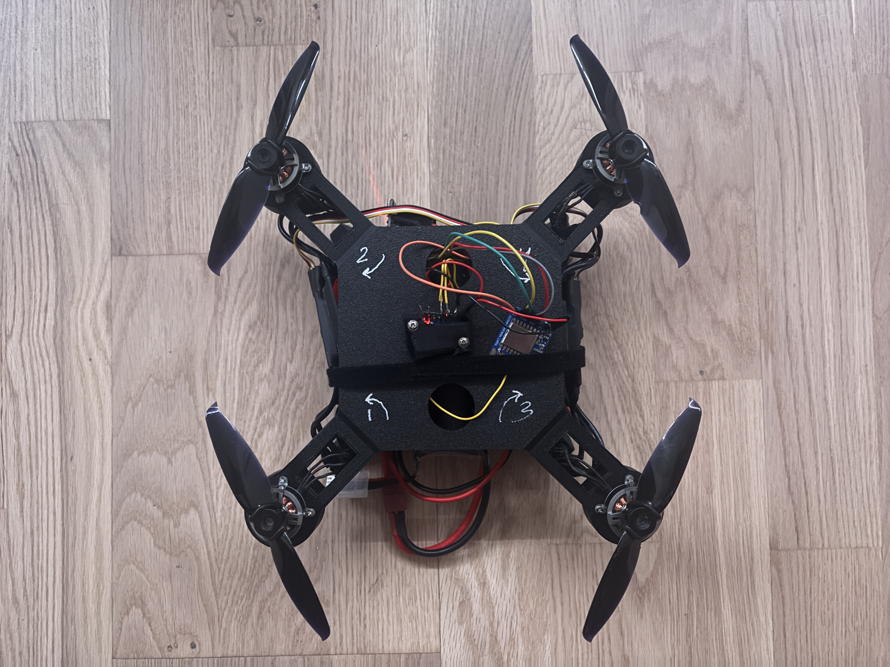
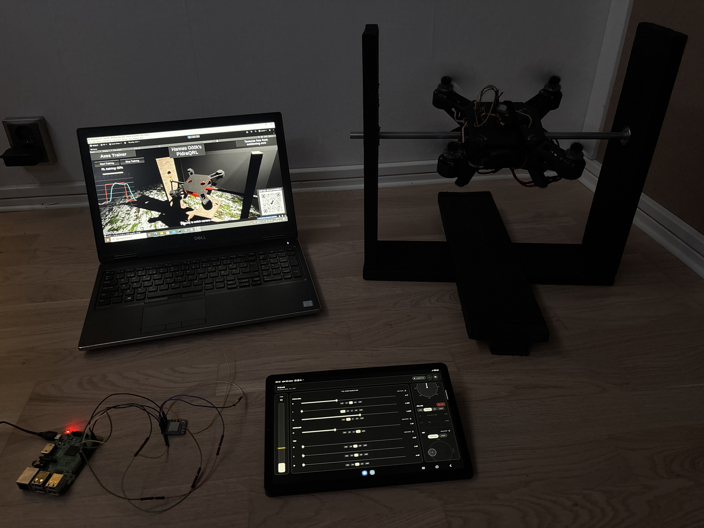
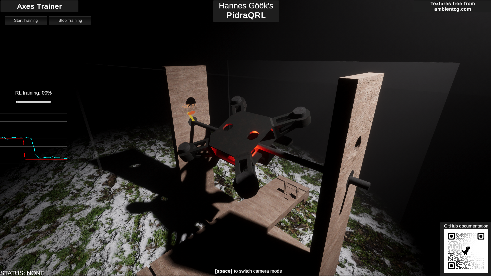
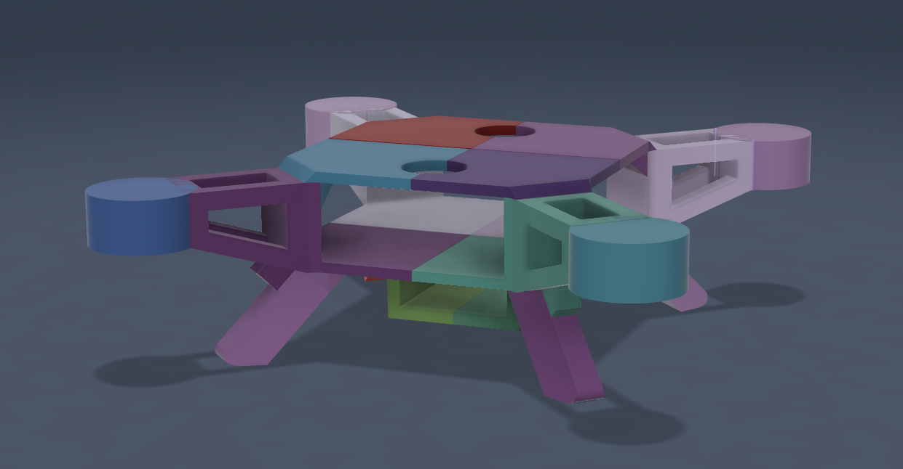
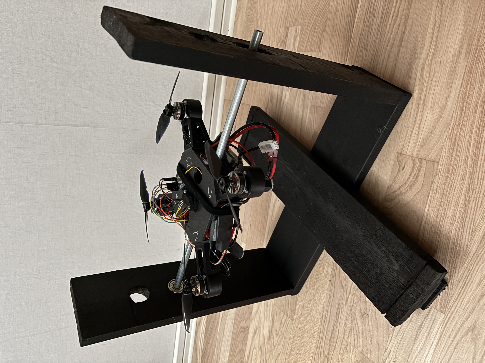
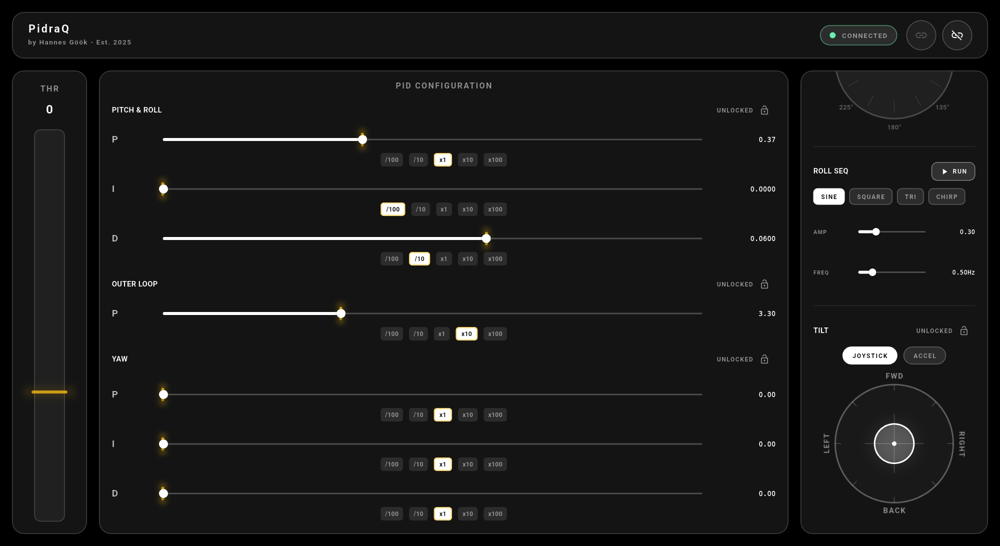

# PidraQRL

**A quadrotor built from scratch, with a live reinforcement learning agent tuning its roll-controller gains in real time and a Unity HDRP digital twin mirroring live telemetry.**

Every layer of this system was built from scratch: the quadrotor chassis (Fusion 360 + 3D print), the ESP32 real-time flight controller, the BLE/LoRa communication chain, the Flutter mobile app, the RL system, and the Unity HDRP digital twin. No off-the-shelf flight stack, no Betaflight, no simulation-to-real transfer.

> 🏆 **Winner of the Yale SEA Most Outstanding STEM Exhibit** - Unga Forskare 2026 National Final (Sweden's Young Researchers national championship)
> 
> 📄 [Official winners list (Swedish)](https://ungaforskare.se/wp-content/uploads/2026/03/alla-vinnare-uuf-2026-1.pdf?utm_source=ig&utm_medium=social&utm_content=link_in_bio&fbclid=PAdGRleAQz6G1leHRuA2FlbQIxMQBzcnRjBmFwcF9pZA8xMjQwMjQ1NzQyODc0MTQAAad5GfXVKqrb3qj2pK-MDdI4lCDxwGsqRKR8YA2ytLWBNzox-uJBilDC0D45dw_aem__15jBvfqmiITrkEP-tInBQ)
> 
> 📄 [Winners announcement with photos (LinkedIn) (Swedish)](https://www.linkedin.com/posts/grattis-till-alla-fantastiska-pristagare-ugcPost-7443214290331017216-65qc?utm_source=social_share_send&utm_medium=member_desktop_web&rcm=ACoAAExydk8B2cZze4JlFAEzUhzplSSweQ-0wBE)
> 
> 📰 [Hulebäcksgymnasiet article (Swedish)](https://hulebacksgymnasiet.harryda.se/nyhetsarkiv/2026-02-27-tavlar-med-egenbyggd-dronare), [School video (Swedish)](https://youtu.be/nFjXQu7kyrs?si=i-YoVVQbaT2_d_f_)
>
> 🎥 [Original demo video for Unga Forskare (Swedish)](https://youtu.be/TsKfvWoOu-4?si=t9hcCkoqaKfQ_xi9)
> 
> 🌐 [Digital exhibition (Projectboard)](https://events.projectboard.world/ungaforskare2026/project/222684)
>
> *"The project stands out through a very high level of technical ambition. The custom-built flight controller, the distributed communication chain, and the well-designed failsafe solution demonstrate a deep understanding of real-time systems, control theory, and system safety. The methodology is exemplarily clear and reproducible."* - Research jury, Unga Forskare 2026 (translated)
> 
> *"In this project, the team members refused to take any shortcuts whatsoever. By rejecting ready-made frameworks and instead building everything from scratch, from communication to software, this work has demonstrated a technical dedication beyond the ordinary."* - Winners catalogue, Unga Forskare 2026 (translated) - [Link (Swedish)](https://ungaforskare.se/wp-content/uploads/2026/03/alla-vinnare-uuf-2026-1.pdf?utm_source=ig&utm_medium=social&utm_content=link_in_bio&fbclid=PAdGRleAQz6G1leHRuA2FlbQIxMQBzcnRjBmFwcF9pZA8xMjQwMjQ1NzQyODc0MTQAAad5GfXVKqrb3qj2pK-MDdI4lCDxwGsqRKR8YA2ytLWBNzox-uJBilDC0D45dw_aem__15jBvfqmiITrkEP-tInBQ)




## What this is

Most RL-for-drone work happens in simulation and then gets transferred to hardware, picking up all the sim-to-real problems along the way. This project skips simulation entirely for the roll-control problem.

A SAC (Soft Actor-Critic) agent runs on a laptop in `rl_bridge.py`, reads roll angle, roll rate, target roll angle, tracking error, and the two current normalised gains (`angleKP`, `roll_P`) from the quadrotor's IMU telemetry at ~50 Hz over BLE, and outputs two continuous actions in `[-1, 1]`. These are linearly scaled to the physical gain ranges:

- `angleKP` in `[3.3, 3.9]`
- `roll_P` in `[0.45, 0.65]`

The roll target itself is **not** learned. Each episode chooses a target roll angle, converts it to `stick_roll = target_deg / 30`, and sends that to the flight controller together with the current gains. During RL training, `roll_I` and `roll_D` are held fixed by the bridge at safe values (`0.0` and `0.0611` respectively). The drone stays on the single-axis test rig during training.

The project has two phases:

**Phase 1: Build the quadrotor from scratch.** Design and print a chassis in Fusion 360, wire up an ESP32 flight controller with an MPU-6050 IMU, write a full real-time stabilisation stack (Madgwick AHRS, biquad LPF, cascade PID, MCPWM ESC driver), build a BLE/LoRa wireless chain, and fly it manually. The drone weighs 760 g, hovers at ~32% throttle, and achieves stable roll/pitch stabilisation at 250 Hz.

**Phase 2: Add RL.** Build a custom single-axis test rig that isolates the roll axis on a near-frictionless bearing, allowing safe operation with live propellers. Train a SAC agent to tune `angleKP` and `roll_P` in real time based on IMU telemetry, targeting arbitrary roll angle setpoints chosen by the training loop.

## Digital twin

A Unity HDRP scene visualises the quadrotor's real-time orientation in a physically realistic environment with PBR materials. The 3D models of both the drone and the test rig were made in Fusion 360 and imported into Unity, so the virtual scene matches the physical setup exactly.

In the current training/demo workflow, `rl_bridge.py` receives IMU telemetry from the ESP32 over BLE and forwards it to Unity over UDP on port `5005`. That UDP telemetry packet contains:

- timestamp (`double`)
- roll, pitch, yaw (`float32`)
- gyro x, y, z (`float32`)
- target roll angle (`float32`)

Unity sends `START_TRAINING` and `STOP_TRAINING` commands to `rl_bridge.py` over UDP on port `5006` and receives status / quality updates back on port `5007`.

The Unity project also contains a direct-BLE receiver mode, but the checked-in `BLEIMUReceiver.cs` still uses older BLE identifiers in that path. The primary active training path is:

**ESP32 BLE → `rl_bridge.py` → Unity UDP**



## Hardware

| Component         | Details                                |
| ----------------- | -------------------------------------- |
| Chassis           | Custom design, Fusion 360, 3D printed  |
| Flight controller | ESP32 DevKit                           |
| IMU               | MPU-6050                               |
| ESCs              | Pulsar A-40 G3.5                       |
| Motors            | Pichler Pulsar Shocky Pro 2204, 1800 kV |
| Props             | 12.5 cm diameter                       |
| LoRa module       | RFM95W @ 433 MHz                       |
| LoRa relay        | Raspberry Pi + LoRa hat                |
| Battery           | 3S 3000 mAh 50C LiPo (11.1 V, 33.3 Wh) |
| Total weight      | 760 g (incl. 220 g battery)            |



## Test rig

To train the RL agent safely with live propellers spinning, a custom single-axis rig was built that constrains the quadrotor to near-frictionless rotation around the roll axis only. This gives the agent clean, repeatable observations without the risk of a crash damaging hardware during training. The rig was designed by Isak Roos and made in wood, then digitalised in Fusion 360 by Hannes Göök and is present in the Unity digital twin.



## System architecture

```text
Flutter app
    │ BLE
    ▼
Raspberry Pi (LoRa relay)
    │ LoRa
    ▼
ESP32-FC ◄──────── BLE ────────► rl_bridge.py
                                      │
                                      ├── UDP telemetry (5005) ──► Unity digital twin
                                      ├── UDP commands   (5006) ◄─ Unity digital twin
                                      └── UDP status     (5007) ──► Unity digital twin
```

Manual control travels through the Raspberry Pi LoRa relay. During RL training, the RL bridge claims BLE control directly and the ESP32 ignores LoRa packets until the claim is released or times out.

## Flight controller

The ESP32 runs a full real-time stabilisation stack written from scratch. No Betaflight, no ArduPilot, no flight stack of any kind.

**Timing:**

| Task             | Rate    | Core | Mechanism                         |
| ---------------- | ------- | ---- | --------------------------------- |
| IMU / PID        | 250 Hz  | 0    | Hardware timer ISR → task notify  |
| Motor write      | 50 Hz   | 0    | `vTaskDelayUntil`                 |
| BLE telemetry TX | 100 Hz  | 1    | Microsecond timer in task         |
| BLE RX drain     | ~200 Hz | 1    | `vTaskDelay` 5 ms                 |
| LoRa RX poll     | ~50 Hz  | 1    | `vTaskDelay` 20 ms                |
| LoRa drain/apply | ~50 Hz  | 1    | `vTaskDelay` 20 ms                |

**Signal processing pipeline:**

```text
MPU-6050 raw data (250 Hz)
    |
    ├── Hardware DLPF: ~21 Hz (configured in MPU register 0x1A)
    |
    ├── Biquad LPF on accel (5 Hz cutoff, Butterworth Q=0.707)
    ├── Biquad LPF on gyro  (10 Hz cutoff, Butterworth Q=0.707)
    |
    └── Madgwick AHRS -> roll, pitch, yaw angles
```

**Startup sequence:**

On every boot the firmware runs several blocking startup stages before any usable flight control is possible:

1. **ESC init / idle output** - `setupMotors()` initialises MCPWM and holds all ESC outputs at `1000 us` for about 3 seconds.
2. **Gyro calibration** - 2000 IMU samples collected at 4 ms intervals, about 8 seconds. The drone must be stationary and level. The sample mean is subtracted from every subsequent gyro reading.
3. **Filter warm-up** - 500 Madgwick update cycles at 4 ms intervals, about 2 seconds, with the hardware LPF and biquad filters running. Once complete, the current roll/pitch/yaw output is stored as the zero reference (`rollOffset`, `pitchOffset`, `yawOffset`).

Total cold-start time before the drone is realistically ready is about **13 seconds**. Keep the drone still and flat on a surface during this window.

**Arming:**

There is no explicit arm switch or arm sequence. The flight controller arms automatically on the first valid `S`- or `R`-packet received after boot (`armed = true`). At that moment the current IMU angles are stored as the arm reference (`rollArmRef`, `pitchArmRef`, `yawArmRef`). All subsequent angle targets are relative to these references, not absolute sensor values.

**Cascade PID structure:**

```text
target_roll_deg  (from stick input or RL episode target)
        |
        v
  Outer loop:   target_rate = angleKP x (target_angle - measured_angle)
        |
        v
  Inner loop:   output = roll_P x (target_rate - measured_rate)
                       + roll_I x integral(error) dt
                       + roll_D x d(rate)/dt
        |
        v
  Mixer -> FL, FR, BL, BR motor PWM (1000-2000 us via MCPWM)
```

**Yaw control:**

Yaw uses a heading-hold strategy rather than a plain rate PID. A `yawHeldDeg` state accumulates heading drift relative to the commanded yaw rate every IMU tick, and the yaw controller closes the loop on that drift:

```text
target_yaw_rate = stick_yaw_rate + angleKP x (0 - yawHeldDeg)
```

So with the yaw stick centred, the quadrotor tries to hold heading instead of slowly spinning with gyro drift.

**Motor layout and mixer signs:**

```text
        FRONT
  FL (CW)   FR (CCW)
      \       /
       [drone]
      /       \
  BL (CCW)  BR (CW)
```

| Motor | Throttle | Pitch | Roll | Yaw |
| ----- | -------- | ----- | ---- | --- |
| FL    | +        | +     | +    | +   |
| FR    | +        | +     | −    | −   |
| BL    | +        | −     | +    | −   |
| BR    | +        | −     | −    | +   |

Positive roll command tilts right (right side down). Positive pitch command tilts nose up. Positive yaw is clockwise.

**Current runtime defaults:**

These are the values actually present in the checked-in code paths:

| Context | `angleKP` | `roll_P` | `roll_I` | `roll_D` | Notes |
| ------- | --------- | -------- | -------- | -------- | ----- |
| Firmware boot init | `10.0` | `0.93` | `0.0` | `0.0` | Placeholder state before first valid packet |
| Flutter app defaults | `3.3` | `0.37` | `0.0` | `0.06` | Current mobile UI default values |
| RL bridge safe defaults | `3.5` | `0.52` | `0.0` | `0.0611` | Used during settle / idle / normal training exit |

In normal operation, the boot defaults are quickly overridden by the first valid control packet.

**BLE arbitration:**

The flight controller accepts commands from two independent sources simultaneously. The RL bridge takes priority using a claim/release protocol:

- `C 0x01`: RL bridge claims BLE control, LoRa packets are discarded
- `C 0x00`: RL bridge releases control, LoRa (manual) control resumes
- If the RL script crashes without releasing, the BLE claim auto-expires after 2 seconds, handing control back to the LoRa path automatically
- BLE disconnect also auto-releases the claim immediately
- While training is active, `rl_bridge.py` refreshes the BLE claim every 0.5 seconds so the ESP32 timeout never expires during a healthy session

**Failsafe:** if no valid packet arrives from the active source within 1 second, all motors are set to `1000 us` (idle).

**Safety cutoff:** if roll exceeds 45°, all motors are immediately idled regardless of control inputs.

## RL agent

The active SAC agent tunes two gains in real time on the flying quadrotor or test rig:

- outer-loop angle gain: `angleKP`
- inner-loop roll rate proportional gain: `roll_P`

The bridge sends these over BLE using normal `S`-packets. The roll setpoint is chosen by the training loop and sent directly as `stick_roll`. The bridge keeps `roll_I` and `roll_D` constant during RL training.

**Active runtime configuration:** `SACAgent(obs_dim=6, action_dim=2)` in `rl_bridge.py`.

> **Note:** some comments and default constructor values inside `actor.py`, `critic.py`, `replay_buffer.py`, and `sac_agent.py` still reflect an older 3-action experiment. The active bridge overrides those defaults and runs a 6-observation, 2-action controller.

### Observation space (6-dimensional, fed to the network as normalised values)

| Index | Variable | Representation inside the observation vector |
| ----- | -------- | -------------------------------------------- |
| 0 | Roll angle | `clip(roll_deg / 45, -1, 1)` |
| 1 | Roll rate | `clip(roll_rate_dps / 300, -1, 1)` |
| 2 | Target roll angle | `clip(target_deg / 45, -1, 1)` |
| 3 | Tracking error | `clip((roll_deg - target_deg) / 45, -1, 1)` |
| 4 | `angleKP` | current gain already normalised to `[-1, 1]` |
| 5 | `roll_P` | current gain already normalised to `[-1, 1]` |

The episode target is generated in `[-30°, 30°]`, but the observation normalisation uses `MAX_ANGLE_DEG = 45.0`.

### Action space (2-dimensional, continuous)

| Index | Variable | Network output range | Physical range |
| ----- | -------- | -------------------- | -------------- |
| 0 | `angleKP` | `[-1, 1]` | `[3.3, 3.9]` |
| 1 | `roll_P` | `[-1, 1]` | `[0.45, 0.65]` |

Actions are output in `[-1, 1]` and linearly scaled to the physical ranges.

### Reward function

**Per-step reward (stored in replay):**

```python
tracking_cost = abs(error_deg) / TARGET_RANGE_DEG
rate_cost = abs(rate_dps) / MAX_RATE_DPS

step_reward = -(W_TRACKING * tracking_cost + W_RATE * rate_cost)

if abs(error_deg) < STABLE_DEG:
    step_reward += STABILITY_BONUS / (EPISODE_DURATION / IMU_LOOP_DT)
```

Constants used by the bridge:

| Constant | Value |
| -------- | ----- |
| `TARGET_RANGE_DEG` | `30.0` deg |
| `MAX_RATE_DPS` | `300.0` deg/s |
| `W_TRACKING` | `2.0` |
| `W_RATE` | `0.3` |
| `W_GAIN_CHANGE` | `0.0` |
| `STABILITY_BONUS` | `3.0` |
| `STABLE_DEG` | `3.0` deg |
| `CRASH_PENALTY` | `-10.0` |

**Episode summary reward** used for logging, best-model tracking, and the quality score:

```python
if crashed:
    ep_reward = CRASH_PENALTY
else:
    ep_reward = -(W_TRACKING * mean_abs_error + W_RATE * mean_abs_rate)
    if mean_abs_error < STABLE_DEG:
        ep_reward += STABILITY_BONUS
```

This episode-level reward is **not** normalised by `TARGET_RANGE_DEG` or `MAX_RATE_DPS`. It uses raw mean absolute error in degrees and raw mean absolute rate in deg/s.

**Quality score** (logged per episode and sent to Unity):

```python
quality = clamp((ep_reward + 30) / 30 * 100, 0, 100)
```

### Training loop

| Parameter | Value |
| --------- | ----- |
| Episode duration | 8 seconds |
| Settle period between episodes | 1.5 seconds |
| Warmup episodes | 15 |
| SAC updates per IMU step | 2, after warmup and once the replay buffer is large enough |
| Roll target | random sign, magnitude uniform in `[10°, 30°]` |
| Exploitation on new best | 3 episodes |
| Checkpoint interval | every 20 episodes |
| Bridge-side control/update cadence | ~50 Hz (`IMU_LOOP_DT = 1/50`) |

Warmup is not full-range random exploration. During the first 15 episodes, the bridge samples actions near the low-gain corner of the action space:

```python
action = np.array([
    -1.0 + np.random.uniform(0, 0.3),
    -1.0 + np.random.uniform(0, 0.3),
], dtype=np.float32)
```

## Communication protocol

The **BLE/LoRa flight-control path** is fully binary. Raw bytes are used throughout, with identical packet formats on BLE and LoRa. The **Unity command/status path** is separate and uses short ASCII UDP messages such as `START_TRAINING`, `STOP_TRAINING`, and `STATUS:QUALITY:87`.

Measured end-to-end latency from the Flutter app to the ESP32 through the BLE→Pi→LoRa chain is about 400 ms. This does not affect stabilisation because all PID computation runs locally on the ESP32 at 250 Hz and incoming packets only update reference setpoints. The high latency of the LoRa path is the main reason the stabilisation loop runs on the ESP32 rather than through the app.

**LoRa relay header stripping:**

The Raspberry Pi LoRa relay prepends a 4-byte header to every forwarded packet. The ESP32 firmware detects this automatically: if the first byte is not `'S'` or `'C'` but byte 4 is `'S'`, the first 4 bytes are skipped before parsing. This stripping is transparent to the rest of the protocol.

**S-packet (34 bytes): full manual command**

| Byte(s) | Field | Encoding |
| ------- | ----- | -------- |
| 0 | Marker `'S'` | `0x53` |
| 1 | Throttle | `uint8`, mapped from `[1000, 2000] us` |
| 2 | Stick roll | `uint8`, mapped from `[-1, 1]` |
| 3 | Stick pitch | `uint8`, mapped from `[-1, 1]` |
| 4 | Stick yaw | `uint8`, mapped from `[-1, 1]` |
| 5-8 | `roll_P` | `float32 LE` |
| 9-12 | `roll_I` | `float32 LE` |
| 13-16 | `roll_D` | `float32 LE` |
| 17-20 | `yaw_P` | `float32 LE` |
| 21-24 | `yaw_I` | `float32 LE` |
| 25-28 | `yaw_D` | `float32 LE` |
| 29-32 | `angleKP` | `float32 LE` |
| 33 | Checksum | XOR of bytes `1-32` |

**R-packet (17 bytes): RL gain command**

| Byte(s) | Field | Encoding |
| ------- | ----- | -------- |
| 0 | Marker `'R'` | `0x52` |
| 1-4 | `stick_roll` | `float32 LE` |
| 5-8 | `angleKP` | `float32 LE` |
| 9-12 | `roll_P` | `float32 LE` |
| 13-16 | `throttle_us` | `float32 LE` |

> The current `rl_bridge.py` uses `S`-packets for training commands. The firmware still supports `R`-packets, and it will arm on the first valid `S` or `R`, but the checked-in bridge does not use `R` in normal training.

**C-packet (2 bytes): BLE claim/release**

| Byte | Value | Meaning |
| ---- | ----- | ------- |
| 0 | `'C'` | `0x43` |
| 1 | `0x01 / 0x00` | Claim / Release |

**I-packet (33 bytes): IMU telemetry (ESP32 to host)**

| Byte(s) | Field |
| ------- | ----- |
| 0 | Marker `'I'` |
| 1-4 | Roll (deg), `float32 LE` |
| 5-8 | Pitch (deg), `float32 LE` |
| 9-12 | Yaw (deg), `float32 LE` |
| 13-16 | Gyro X (deg/s), `float32 LE` |
| 17-20 | Gyro Y (deg/s), `float32 LE` |
| 21-24 | Gyro Z (deg/s), `float32 LE` |
| 25-28 | Target roll angle (deg), `float32 LE` |
| 29-32 | ESP32 timestamp (us), `uint32 LE` |

**Unity UDP telemetry packet (36 bytes):**

| Field | Type |
| ----- | ---- |
| Host timestamp | `double` |
| Roll | `float32` |
| Pitch | `float32` |
| Yaw | `float32` |
| Gyro X | `float32` |
| Gyro Y | `float32` |
| Gyro Z | `float32` |
| Target roll angle | `float32` |

**LoRa RF parameters:**

| Parameter | Value |
| --------- | ----- |
| Frequency | 433 MHz |
| Spreading factor | SF7 |
| Signal bandwidth | 125 kHz |
| Coding rate | 4/5 |
| CRC | Enabled |

## Flutter controller app

The Flutter app connects to the Raspberry Pi BLE-LoRa bridge (`BLE-LoRa-Bridge`) over BLE and sends `S`-packets using the bridge's Nordic UART-style service/characteristic UUIDs. It includes:

- a fixed-base joystick for pitch/roll
- a yaw dial with degree markings
- a vertical throttle slider
- per-axis PID sliders with adjustable multipliers
- a roll sequence generator (`sine`, `square`, `triangle`, `chirp`)
- accelerometer tilt control, where the phone itself becomes the stick
- per-axis locks to prevent accidental input during tuning

Current app defaults in the checked-in code:

- `roll_P = 0.37`
- `roll_I = 0.0`
- `roll_D = 0.06`
- `yaw_P = yaw_I = yaw_D = 0.0`
- `angleKP = 3.3`



## Running the RL bridge

```bash
pip install bleak numpy torch
python rl_bridge.py
```

The bridge:

1. scans for `ESP32-FC`
2. runs a packet self-test before any BLE control is used
3. starts a BLE thread and a 10 Hz heartbeat thread
4. forwards IMU telemetry to Unity over UDP
5. waits for a `START_TRAINING` UDP command from Unity on port `5006`

**Pre-flight checklist before starting a training session:**

1. Place the drone on the test rig with propellers clear of obstructions
2. Power on the drone and wait about 13 seconds for ESC init, gyro calibration, and filter warm-up to complete. The drone must remain stationary and level during this window
3. Bring the drone to a stable hover throttle via the Flutter app
4. Start `rl_bridge.py`. It will connect over BLE and run its packet self-test
5. Send `START_TRAINING` from the Unity digital twin

The RL agent does not handle takeoff or landing. Throttle is fixed by the bridge during training (`1150 us`) and must be set appropriately for the rig and prop load before starting a session.

On a **normal stop** or a **handled exception inside `training_loop()`**, `rl_bridge.py` sends safe-default gains and releases BLE control in its `finally` block. If the Python process dies abruptly, the firmware-side safety nets take over instead: BLE disconnect auto-release and the 2-second BLE claim timeout.

## BLE connection parameters

The ESP32 firmware is configured for the following BLE connection parameters:

| Parameter | Value |
| --------- | ----- |
| MTU | 517 bytes |
| Connection interval | `6 × 1.25 ms = 7.5 ms` |
| Slave latency | 0 |
| Supervision timeout | `100 × 10 ms = 1000 ms` |
| TX power | `+9 dBm` |

## Repository structure

```text
PidraQRL/
├── firmware/
│   └── flight_controller/      # ESP32 Arduino sketch
├── bridge/
│   ├── rl_bridge.py            # SAC agent + BLE interface + Unity UDP bridge
│   └── lora_ble_bridge.py      # Raspberry Pi BLE->LoRa relay
├── rl/
│   ├── actor.py
│   ├── critic.py
│   ├── replay_buffer.py
│   └── sac_agent.py            # SAC implementation
├── app/                        # Flutter controller app
├── unity/                      # Unity HDRP digital twin
├── docs/                       # Images referenced in this README
├── checkpoints/                # Saved model weights (gitignored)
└── README.md
```

## Performance

| Metric | Value |
| ------ | ----- |
| Total weight | 760 g (incl. 220 g battery) |
| Hover throttle | ~32% |
| Battery life (hover) | ~6 minutes |
| IMU / PID loop | 250 Hz |
| BLE telemetry TX | 100 Hz |
| LoRa RX poll | ~50 Hz |
| LoRa control RX | ~50 Hz |
| RL bridge control / obs loop | ~50 Hz |
| Communication latency | ~400 ms (Flutter app to drone through Pi + LoRa path) |

## Safety

- **45° roll cutoff:** firmware idles all motors if roll exceeds 45°
- **1-second failsafe:** motors idle if no valid packet arrives within 1 second
- **2-second BLE auto-release:** if the RL script crashes mid-training and stops refreshing the BLE claim, manual LoRa control can resume automatically
- **BLE disconnect release:** BLE claim is released immediately on disconnect, not only on timeout
- **Bridge claim refresh:** while training is healthy, the bridge refreshes the BLE claim every 0.5 seconds
- **Narrow gain ranges:** the RL action space is bounded to values manually verified to produce stable operation
- **Normal-exit safe defaults:** on normal stop and handled training errors, `rl_bridge.py` sends safe-default gains and releases BLE in `finally`
- **Test rig for RL training:** the single-axis rig constrains the quadrotor during training so a bad action cannot produce a free-flight crash
- **Startup hold:** ESC init, gyro calibration, and filter warm-up take about 13 seconds on boot, and the drone must remain still and level during this window

## Team

| Member | Role |
| ------ | ---- |
| **Hannes Göök** | Project lead. Sole author of all software: flight controller firmware, PID/IMU/AHRS, wireless comms (BLE + LoRa), Flutter app, Unity HDRP digital twin, RL bridge and SAC implementation, system architecture and integration. Also responsible for Fusion 360 chassis and rig CAD. |
| **Isak Roos** | Budgeting, hardware, soldering, documentation, test rig construction, testing |
| **Olle Einvall** | Mechanical sketches, documentation, safety analysis, testing |
| **Hugo Persson** | Hardware preparation, video documentation, testing |

Supervisor: Katarina Brännström, Hulebäcksgymnasiet, Mölnlycke

## Previous version

The original Arduino Uno-based flight controller and LoRa chain is archived at [quadcopter-ble-lora-controller](https://github.com/hannesgook/quadcopter-ble-lora-controller). That repo represents the system before the ESP32 upgrade and RL work and is kept for historical reference.

## License

MIT License, Copyright (c) 2025-2026 Hannes Göök

## Acknowledgements

- [MadgwickAHRS](https://github.com/arduino-libraries/MadgwickAHRS)
- [NimBLE-Arduino](https://github.com/h2zero/NimBLE-Arduino)
- [arduino-LoRa](https://github.com/sandeepmistry/arduino-LoRa)
- [Bleak](https://github.com/hbldh/bleak)
- [flutter_reactive_ble](https://github.com/PhilipsHue/flutter_reactive_ble)
- Spinning Up in Deep RL, Josh Achiam, OpenAI
