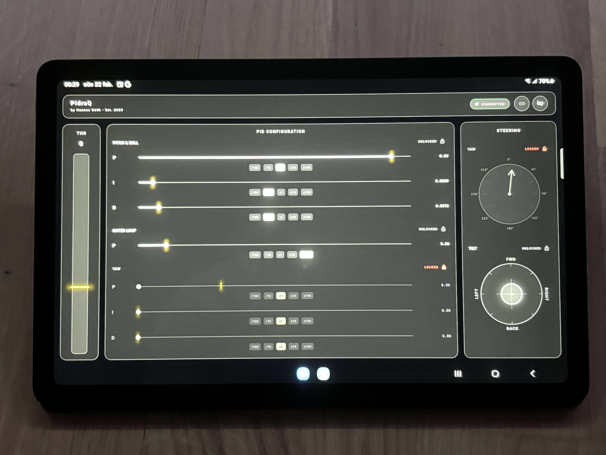
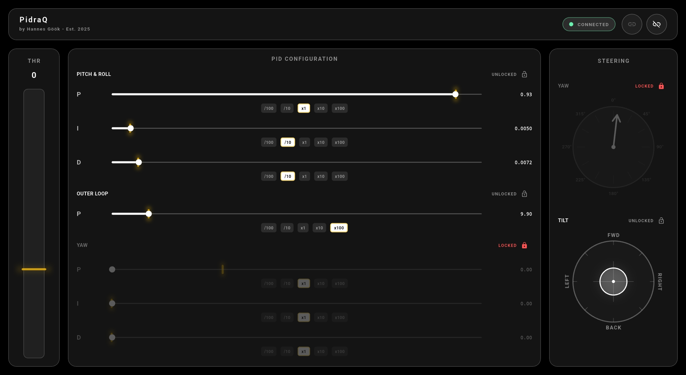

# PidraQ - Flutter Drone Control App

A Flutter mobile app for controlling my custom quadcopter, built entirely from scratch. Sends control data over BLE to a Raspberry Pi, which transmits it over LoRa to the flight controller. Part of the full system: [quadcopter-ble-lora-controller](https://github.com/hannesgook/quadcopter-ble-lora-controller)

## What This Is

PidraQ is the control interface for the drone.
It connects to a Raspberry Pi over Bluetooth Low Energy and streams control data at 10 Hz. Throttle, tilt, yaw, PID values. Everything goes through BLE to the Pi, then over LoRa to the flight controller.

Controls include joysticks, sliders and multipliers. All controls work.




## Features

- BLE scan + connect to the Raspberry Pi bridge on button press
- Throttle slider (0-100)
- Tilt joystick (+-15° range)
- Yaw control
- Live PID tuning for:
  - Roll / Pitch
  - Yaw
  - Outer angle loop
- Lock controls to avoid changing things mid-flight

Everything updates in real time.

## Communication Protocol

Each BLE packet is 33 bytes, sent every 100 ms.

| Byte(s) | Content                          |
| ------- | -------------------------------- |
| 0       | Start byte `0x53`                |
| 1       | Throttle (0–255)                 |
| 2       | Tilt X (0–255, center = 127)     |
| 3       | Tilt Y (0–255, center = 127)     |
| 4       | Yaw (0–255, center = 127)        |
| 5–8     | Roll/Pitch P (float32 LE)        |
| 9–12    | Roll/Pitch I (float32 LE)        |
| 13–16   | Roll/Pitch D (float32 LE)        |
| 17–20   | Yaw P (float32 LE)               |
| 21–24   | Yaw I (float32 LE)               |
| 25–28   | Yaw D (float32 LE)               |
| 29–32   | Outer loop angle KP (float32 LE) |

BLE target:

- Nordic UART Service (NUS)
- Device name: `BLE-LoRa-Bridge`

## Default PID Values

These are the tuned baseline values shipped with the app:

| Parameter      | Default |
| -------------- | ------- |
| Roll/Pitch P   | 0.93    |
| Roll/Pitch I   | 0.005   |
| Roll/Pitch D   | 0.00716 |
| Yaw P          | 0.3     |
| Yaw I          | 0.0     |
| Yaw D          | 0.0     |
| Outer angle KP | 10.0    |

## Getting Started

Works on Android, not tested on iOS yet.

```
flutter pub get
flutter run
```

### Requirements

- Flutter SDK (stable)
- Android device with BLE support (I have not yet tested iOS support)
- Required permissions: `BLUETOOTH_SCAN`, `BLUETOOTH_CONNECT`, `ACCESS_FINE_LOCATION`

### Dependencies

| Package                | Purpose                      |
| ---------------------- | ---------------------------- |
| `flutter_reactive_ble` | BLE scanning + communication |
| `permission_handler`   | Runtime permissions          |

## System Architecture

Full pipeline:

```
Mobile App -> BLE -> Raspberry Pi -> LoRa -> Arduino Flight Controller
```

The complete project including flight controller code, Raspberry Pi bridge, and CAD files is in the [root repository](https://github.com/hannesgook/quadcopter-ble-lora-controller).

## License

MIT License - © 2025 Hannes Göök
